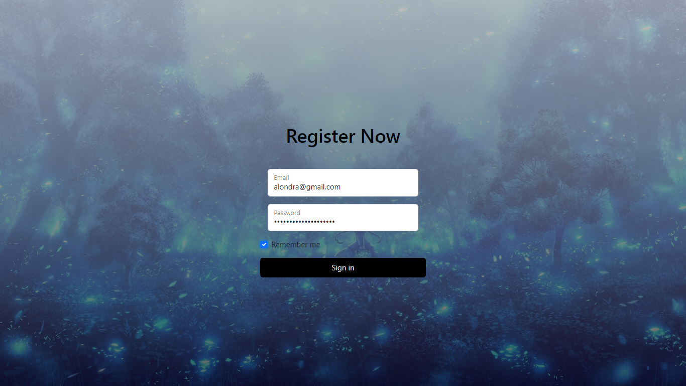
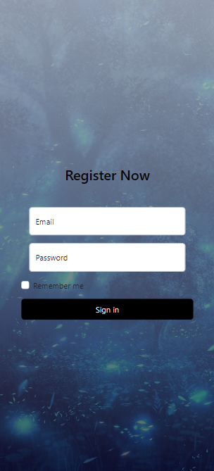
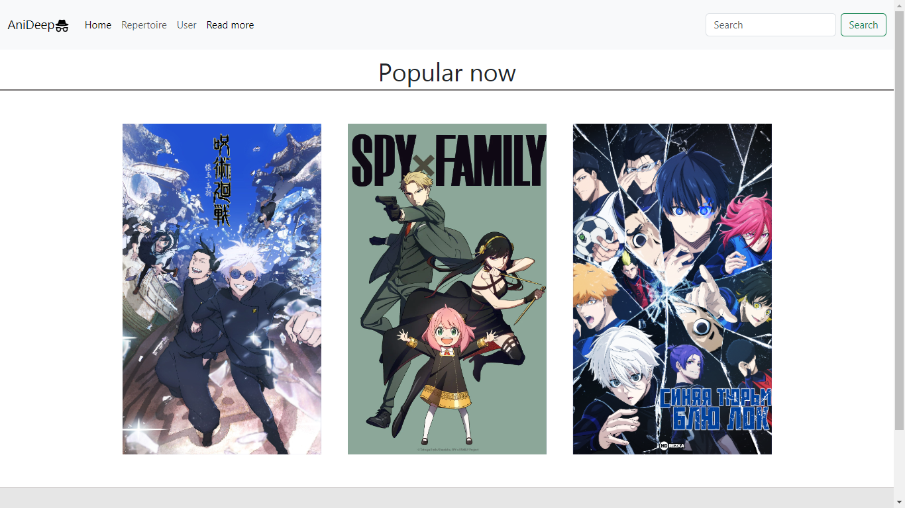
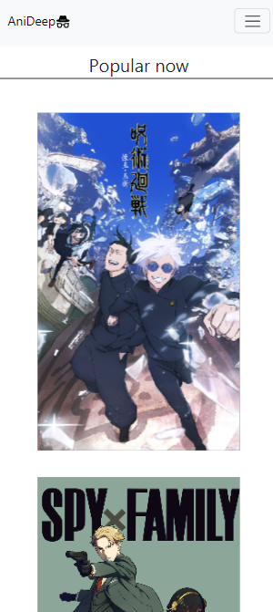
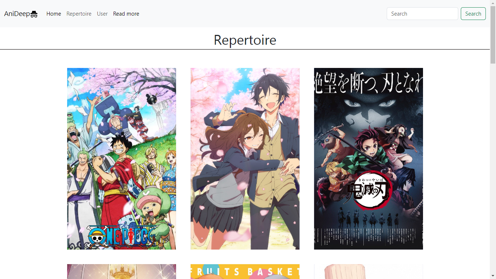
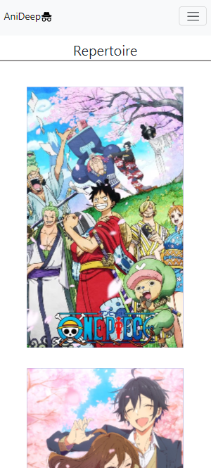
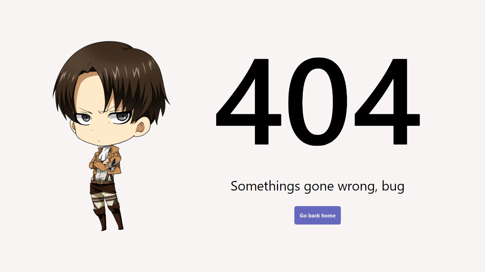

# Anideep - Anime gender list

This mini application was created for a task regarding consuming APIS from the server side. It is just a sample of what will soon be an application with more utilities

## Overview

### The idea 

In its full implementation, you should be able to navigate around the entire page, log in, save favorites in the user section, and watch anime comfortably.

### Screenshots & Figma

- Figma desing - [figma](https://www.figma.com/file/7w6QD1G9QfyMuA6VwS9X9R/Untitled?type=design&node-id=0-1&mode=design&t=8gl2a2VbQ3Xzl0Et-0)

### Built with

- HTML5
- Css
- JavasCript
- Node Js
- Boostrap
- React (Icons and router)
- Vite
- Express JS
- Mysql2

## Author

- Github - [AlooNDRaa](https://github.com/AlooNDRaa)
